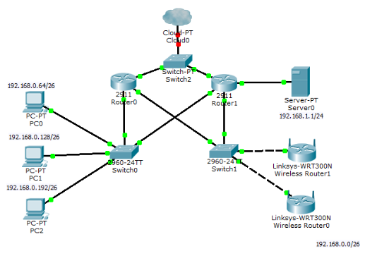

# Задание на курсовой проект

**студенту _Старостину Григорию Максимовичу_**

группы _КС412_ специальности 09.02.06 «Сетевое и системное администрирование»

### Тема проекта: _Эксплуатация компьютерной сети центра правовой защиты населения_

## 1. Исходные данные

**Постановка задачи:**

Центр эксплуатирует компьютерную сеть с выделенным сервером на первом, втором и третьем этажах здания. Компьютерная сеть имеет гостевой беспроводной сегмент. Сотрудники обеспечены доступом к сети Интернет в кабинетах и на прилегающей территории.

Администрация отдает предпочтение системному программному обеспечению Eltex. На сервере установлена операционная система RedOS. Доступ к глобальной сети Интернет осуществляется с помощью услуг провайдера Дом.ru. VPN используется для связи с филиалом. В филиале также установлен Eltex.

Создать модель сети используя виртуальное оборудование. Создать сетевые конфигурации обеспечивающие: организацию потоков трафика согласно матрицы доступа (ACL), средства отказоустойчивости, средства защиты, мониторинг устройств (Zabbix) и их удаленное управление. Произвести тестирование сети.

Содержание работы:

1.  Пояснительная записка.
2.  Реальная часть.

Пояснительная записка

Введение

1.  Аналитическая часть
    1.  Постановка задачи эксплуатации сети
    2.  Анализ логической топологической карты
    3.  Обзор средств безопасности компьютерных сетей
    4.  Обзор средств тестирования сети
    5.  Обзор средств мониторинга сети
2.  Технологическая часть
    1.  Описание решения организации потоков трафика согласно матрицы доступа
    2.  Описание решения отказоустойчивости
    3.  Описание решения обеспечения безопасности
    4.  Анализ результатов мониторинга устройств
    5.  Анализ результатов тестирования сети
3.  Заключение

Реальная часть

Модель сети.

### Рекомендуемая литература

1 Основная

1.1 Андрончик А. Н. Сетевая защита на базе технологий фирмы Cisco Systems. Практический курс: учеб. пособие. – Екатеринбург: изд-во Урал. ун-та, 2014. – 180 с.

1.2 [Даниленко А. Ю.](http://www.moscowbooks.ru/catalog/author.asp?name=%C4%E0%ED%E8%EB%E5%ED%EA%EE+%C0%2E+%DE%2E) Безопасность систем электронного документооборота. Технология защиты электронных документов. – М.: Ленанд, 2015. – 232 с.

1.3 [Девянин П.Н.](http://www.techbook.ru/book_list.php?str_author=%D0%94%D0%B5%D0%B2%D1%8F%D0%BD%D0%B8%D0%BD%20%D0%9F.%D0%9D.) Модели безопасности компьютерных систем. Управление доступом и информационными потоками. Учебное пособие для вузов. – Издательство: «Горячая линия – Телеком», 2013. – 338 с.

1.4 Марков А.С., Цирлов В.Л., Барабанов А.В. Методы оценки несоответствия средств защиты информации. — М.: Радио и связь, 2012. - 192 с.

1.5 Назаров А.В., Мельников В.П., Куприянов А.И., Енгалычев А.Н. Эксплуатация объектов сетевой инфраструктуры: учебник для студ. учреждений сред. проф. образования; под ред. А. В. Назарова. - М.: Издательский центр «Академия», 2014. - 368 с.

2 Дополнительная

- 1.  Кенин А. М. Практическое руководство системного администратора. — СПб.: БХВ -Петербург, 2010. — 464 с.: ил.
    2.  Макин Дж.К., Десаи Анил. Развертывание и настройка Windows Server® 2008. Учебный курс Microsoft /Пер. с англ. — М.: Издательство «Русская редакция», 2008. — 640 стр.: ил.
    3.  Альваро Ретана, Дон Слайс, Расс Уайт. Принципы проектирования корпоративных IP-сетей, серия [Cisco Press](http://www.williamspublishing.com/cgi-bin/series.cgi?seria=Cisco%20Press#list). Издательский дом «Вильямс», 2002. - 368 стр. с ил.

Тема утверждена на заседании ЦМК Компьютерных технологий защиты и сетей. Протокол №5 от 12 января 2026 г.

|     |     |     |
| --- | --- | --- |
| Председатель ЦМК |     | И.Г. Адринский |
| Руководитель курсового проекта |     | И.Г. Адринский |

**Приложение.**

Рисунок 1 - Логическая топологическая карта

|     |     |     |     |     |     |     |
| --- | --- | --- | --- | --- | --- | --- |
| В  Из | Группа администрации комплекса | Гостевая сеть | Сеть сотрудников | Группа управления сетью | Интернет | Сервер |
| Группа администрации комплекса |     | \-  | +   | +   | +   | +   |
| Гостевая сеть | \-  |     |     | +   | +   | \-  |
| Сеть сотрудников | +   | \-  |     | +   | \-  | +   |
| Группа управления сетью | +   | +   | +   |     | +   | +   |
| Интернет | +   | +   | \-  | +   |     | \-  |
| Сервер | +   | \-  | +   | +   | \-  |     |

Таблица 1 - Матрица доступа («+» доступ разрешен, «-» доступ запрещен)